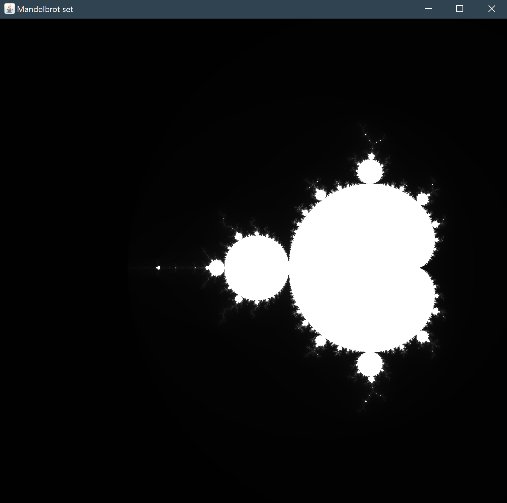

# Mandelbrot-Set
The famous Mandelbrot Set, a fractal presented on the complex plane, rendered in Java.

## Requirements
* NetBeans or any Java IDE

## Instructions
Simply open the Mandelbrot-Set project in NetBeans or other Java IDE and hit run. It will automatically render the Mandelbrot Set. 

## Screenshot

## Built With
* Java

## Author(s)
* Kevin Huang
